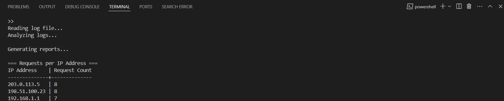
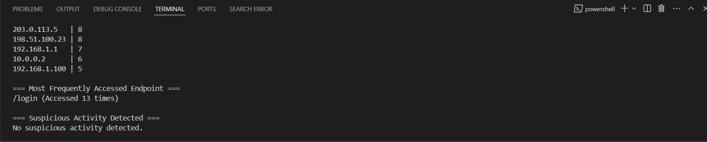

### Log Analysis Script


## **Introduction**

The **Log Analysis Script** is a Python-based tool designed to analyze web server log files. It extracts valuable insights such as the number of requests per IP address, the most frequently accessed endpoint, and potential brute force attempts. This script is a valuable asset for cybersecurity professionals and system administrators to monitor and analyze server activities effectively.


#### Requests per IP Address:


#### Suspicious Activity Detected:


## **Features**

### 1. **Count Requests per IP Address**
   - Parses the log file to identify the number of requests made by each IP address.
   - Results are displayed in descending order of request counts.

### 2. **Identify the Most Frequently Accessed Endpoint**
   - Extracts all endpoints (e.g., URLs or resource paths) from the log file.
   - Identifies the endpoint with the highest access count.

### 3. **Detect Suspicious Activity**
   - Flags potential brute force login attempts by identifying:
     - Failed login attempts based on HTTP status code `401` or the message `"Invalid credentials"`.
     - IP addresses with failed attempts exceeding a configurable threshold (default: 10 attempts).

### 4. **Output Results**
   - Results are displayed in the terminal and saved to a CSV file (`log_analysis_results.csv`) with the following sections:
     - **Requests per IP**: `IP Address`, `Request Count`.
     - **Most Accessed Endpoint**: `Endpoint`, `Access Count`.
     - **Suspicious Activity**: `IP Address`, `Failed Login Count`.


## **Getting Started**

### **Prerequisites**
- Python 3.x installed on your system.
- Basic knowledge of Python file handling and terminal commands.

### **Installation**
1. Clone or download this repository.
2. Ensure the sample log file (`sample.log`) is located in the same directory as the script.

### **Usage**
1. Open a terminal and navigate to the directory containing the script.
2. Run the script using the command:
   ```bash
   python log_analysis.py
   ```
3. The script will:
   - Parse the `sample.log` file.
   - Display results in the terminal.
   - Save results to `log_analysis_results.csv`.


## **File Structure**

- `log_analysis.py` : The main Python script for log analysis.
- `sample.log` : A sample web server log file for testing the script.
- `log_analysis_results.csv` : The output file containing analyzed data.


## **Configuration**

### **Customizing the Threshold for Suspicious Activity**
- The default threshold for flagging IP addresses with failed login attempts is `10`.
- To change this, edit the `THRESHOLD` variable in the script:
   ```python
   THRESHOLD = <desired_number>
   ```


## **Sample Output**

### **Terminal Output**

#### Requests per IP Address:
```
IP Address           Request Count
192.168.1.1          6
203.0.113.5          10
10.0.0.2             8
...
```

#### Most Frequently Accessed Endpoint:
```
Most Frequently Accessed Endpoint:
/home (Accessed 6 times)
```

#### Suspicious Activity Detected:
```
Suspicious Activity Detected:
IP Address           Failed Login Attempts
203.0.113.5          10
192.168.1.100        7
```


### **CSV Output Structure**

#### **Section 1: Requests per IP**
| IP Address    | Request Count |
|---------------|---------------|
| 192.168.1.1   | 6             |
| 203.0.113.5   | 10            |

#### **Section 2: Most Accessed Endpoint**
| Endpoint      | Access Count |
|---------------|--------------|
| /home         | 6            |

#### **Section 3: Suspicious Activity**
| IP Address    | Failed Login Count |
|---------------|--------------------|
| 203.0.113.5   | 10                 |
| 192.168.1.100 | 7                  |


## **Performance**
The script is designed to handle large log files efficiently. Optimized algorithms and file handling methods ensure scalability.


## **Author**
Tejas Sanjay Gupta


